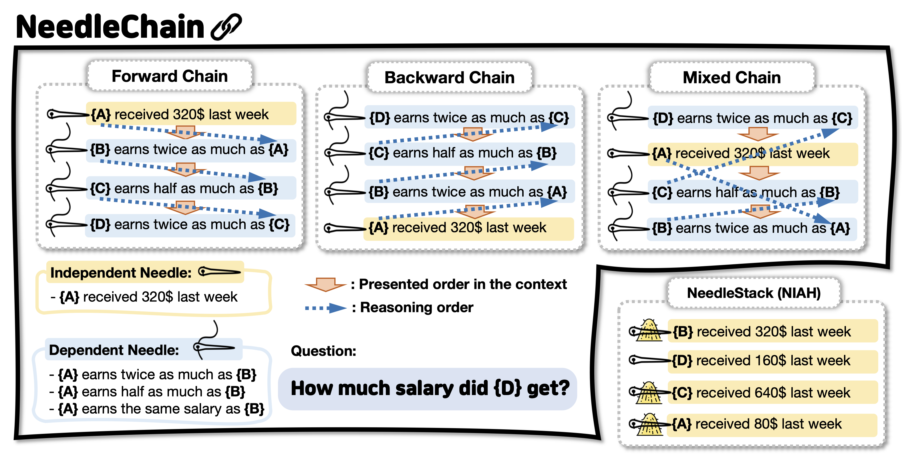

## NeedleChain: Measuring Intact Long-Context Reasoning Capability of Large Language Models

<p align="center">
🤗 <a href="https://huggingface.co/datasets/hyeonsss/needlechain"> Dataset on HuggingFace </a>
<br>
    📄 <a href="https://arxiv.org/abs/2507.22411"> Official Paper </a>
<br>

<p align="center">
  
</p>

NeedleChain is a benchmark designed to evaluate LLMs' intact long-context understanding. 
Every provided context consists of query-relevant information, requiring a comprehensive understanding to answer the given query.

---

## Data Genration

We placed sample data used in our experiments in the `./data` folder.
For those interested in our work, we provide all code to allow flexible configuration of our benchmark.
Anyone can generate custom data by executing the code below.

```
python make_data.py
--k 5 \                # number of needles for each chain
--n 200 \              # number of chain for each dataset
--val 1600 \           # standard salary value for each needle
--results_dir "./data" # data save path
```

---

## Inference

Our codebase aligns with the <a href="https://github.com/vllm-project/vllm"> vLLM </a> framework. We conducted experiments using eight RTX A6000 GPUs, and the requirements in our experimental setup were as follows.
- torch==2.6.0+cu124
- vllm==0.8.5
- transformers==4.53.1
- openai==1.97.0


### - Model serving (openai-compatible): For HF models only
```
nohup python model_serve.py --model_name QwQ > logs/model &
```
For ```model_name``` config, refer ```utils.py``` for more details

```python
model_arg_dict = {
    'qwen2.5-32B':   'Qwen/Qwen2.5-32B-Instruct',
    'qwen3-32B':     'Qwen/Qwen3-32B',
    'llama3.3-70B':  'meta-llama/Llama-3.3-70B-Instruct',
    'llama3.1-DS':   'deepseek-ai/DeepSeek-R1-Distill-Llama-70B',
    'qwen2.5-DS':    'deepseek-ai/DeepSeek-R1-Distill-Qwen-32B',
    'qwen_long':     'Qwen/QwenLong-L1-32B',
    'QwQ':           'Qwen/QwQ-32B',
}
```

### - Inference (For HF, after model serving)

```
python inference_call.py \
--model_name QwQ \          # refer model_arg_dict
--output_name QwQ_output \  # anything - desired output name
--chain_type forward \      # Choice: [forward, backward, chaotic(mixed), parallel(needlestack)]
--question_type single \    # Choice: [single, total]
--k 10 \                    # Choice: [5, 10, 20, 50, 100, 200]
--results_dir ./results     # anything - desired result path dir
```

```
python inference_call.py \
--model_name gpt-4o \       # refer inference_call.py
--output_name gpt_output \  # anything - desired output name
--chain_type forward \      # Choice: [forward, backward, chaotic(mixed), parallel(needlestack)]
--question_type single \    # Choice: [single, total]
--k 10 \                    # Choice: [5, 10, 20, 50, 100, 200]
--results_dir ./results     # anything - desired result path dir
```


---

## Evaluation

Note that, ```results_dir``` in `evaluate.py` must be accurately specified.
```
python evaluate.py
```


